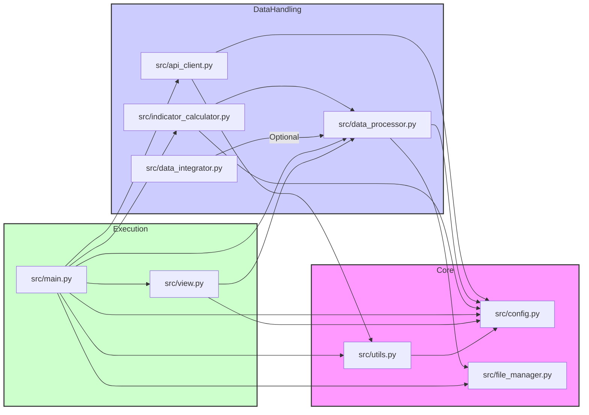

# コード修正計画

ユーザー様から提供された修正案に基づき、以下のPythonファイルを修正します。修正は、各ファイルに対して提案されたコード全体を適用する形で行います。

## 修正対象ファイル

1.  `src/config.py`
2.  `src/utils.py`
3.  `src/api_client.py`
4.  `src/file_manager.py`
5.  `src/data_processor.py`
6.  `src/indicator_calculator.py` (コードモードで内容を確認し、必要に応じて修正)
7.  `src/main.py`
8.  `src/view.py`

## ファイル間の依存関係 (参考)

## 実行手順

以下の手順で修正を進めます。

1.  **`src/config.py` の修正:** 提供された修正後のコードで `src/config.py` を上書きします。
2.  **`src/utils.py` の修正:** 提供された修正後のコードで `src/utils.py` を上書きします。
3.  **`src/api_client.py` の修正:** 提供された修正後のコードで `src/api_client.py` を上書きします。
4.  **`src/file_manager.py` の修正:** 提供された修正後のコードで `src/file_manager.py` を上書きします。
5.  **`src/data_processor.py` の修正:** 提供された修正後のコードで `src/data_processor.py` を上書きします。
6.  **`src/indicator_calculator.py` の確認と修正:** コードモードで内容を確認し、依存関係（`config`, `data_processor`）の変更による影響がないか確認し、必要であれば修正します。
7.  **`src/main.py` の修正:** 提供された修正後のコードで `src/main.py` を上書きします。
8.  **`src/view.py` の修正:** 提供された修正後のコードで `src/view.py` を上書きします。